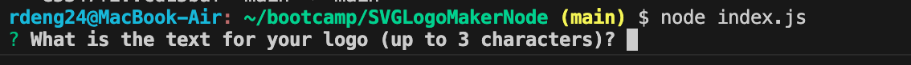
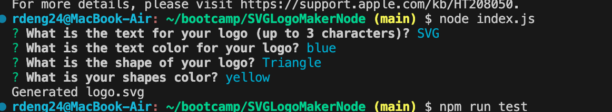
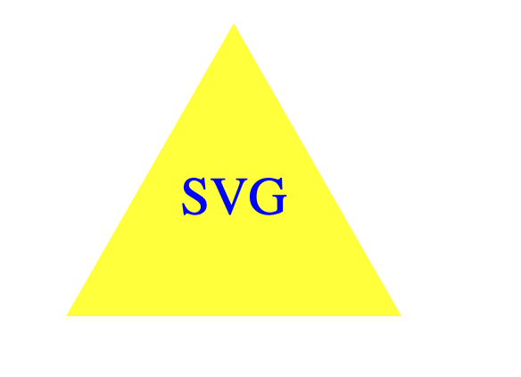
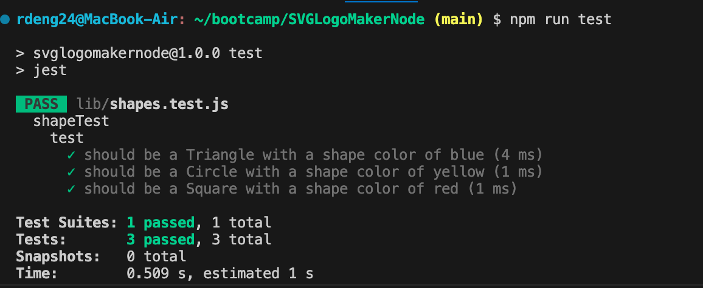

# SVGLogoMakerNode

## Description 
The motivation behind the project was to create an application using node.js that allows a user to answers a series of questions in the command line (using inquirer) that generates a logo.svg file that creates a desired shape with specific characteristics (shape color, text color, etc). We built this project so that users can easily generate shapes simply by using the back-end and typing questions into the command line. It solves the problem of creating something easy to use and navigate for the user when trying to generate a shape they might need for something. I learned a lot about being to run tests using jest to make sure that you are properly generating your desired outcome, using constructors and creating inheritence classes so that the child class can inherit the properties from them, as well as exporting different modules. 

## Installation 

First you have to type "npm init -y" to retrieve the package.json file. 
Then you run "npm Inquirer@8.2.4" to install the node modules that you will use with inquirer.
Type in node.js to invoke the application.
In order to run the tests you created, type in "npm run test" 

## Usage 

Link to video-walkthrough of how the application works to generate logo.SVG: 
https://drive.google.com/file/d/1em_wHw-3-Q5h4u21Bm0iQHn_q4E9zwd4/view

Instructions for ![StartApplication]: Start the application by typing in node.js which will generate a series of prompted questions 
![Answers]: After you've input your answers to the questions, a logo.svg should be generated that matches your input 
![logo.svg]: This is the logo generated based on your answers 
![ShapesTest]: Run a test for your shapes that returns a specific string and shape color by running npm run test and see if your tests pass 

## License 

Please refer to the LICENSE in the repo

## Tests 

Created a test for the each shape class (Triangle, Square, Circle) that tests for a render() method that returns a string for the corresponding SVG file with the provided shape color. 
You run these tests by typing in "npm run test" in the command line 